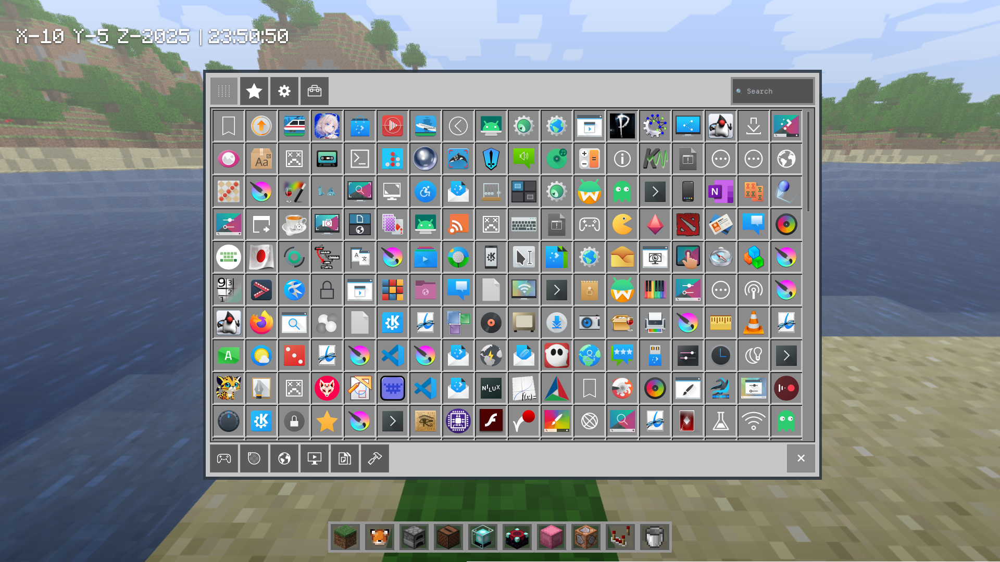
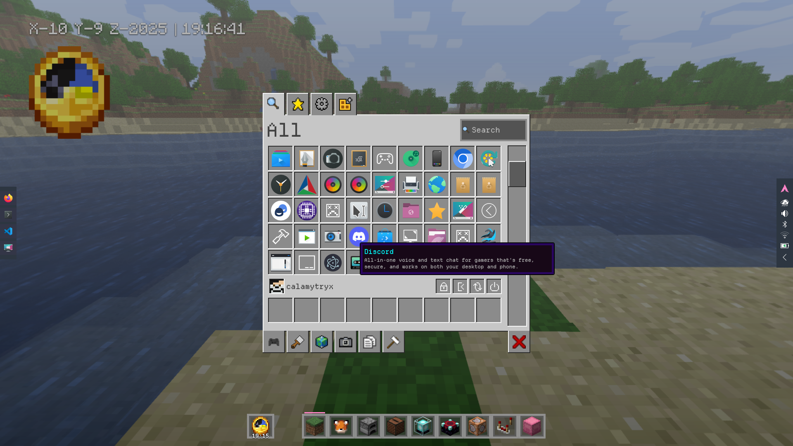
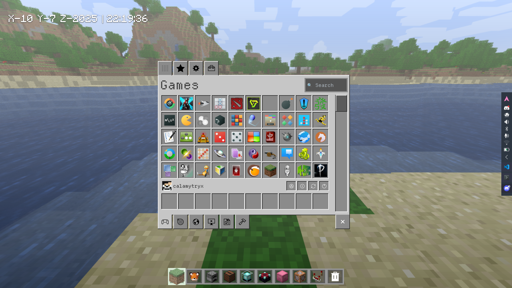

# 🟩 MineLauncher — Minecraft-Style KDE Plasma App Launcher

**MineLauncher** (package ID: `mc_inventory`) is a KDE Plasma 6 plasmoid that transforms your desktop app launcher into a **Minecraft Creative Inventory**–inspired grid.  
Browse your applications with category tabs, a favorites bar, and authentic Minecraft-style UI elements. 🧱

---





---

## 🔗 Also Try

💡 If you like this Launcher, you might also enjoy:
[**MineClock on GitHub**](https://github.com/Calamytryx/MineClock) — another Minecraft-style plasmoid with similar fun vibes!

---

## 🧩 Features

✅ **Grid-based launcher UI** — 9×5 scrollable app grid with Minecraft-style borders  
✅ **Category tabs** — Top and bottom tabs (like Minecraft's Creative tabs)  
✅ **Favorites bar** — Pin up to 9 visible favorite apps for quick access (additional favorites are stored but only the first 9 are shown in the bar)  
✅ **Search functionality** — Real-time app filtering  
✅ **User profile bar** — Display username with Minecraft avatar support  
✅ **Power controls** — Lock, logout, reboot, and shutdown buttons  
✅ **Custom scrollbar** — Minecraft-style scrollbar with row snapping  
✅ **Color-coded categories** — Apps display category colors in tooltips  
✅ **Configurable** — Custom launcher icon, size, avatar URL, and always expanded option  
✅ Built in pure **QML + JS** for Plasma 6  

---

## 📂 Folder structure

```
mc_inventory
├── contents
│   ├── config
│   │   ├── config.qml
│   │   └── main.xml
│   ├── ui
│   │   ├── CategoryTab.qml
│   │   ├── CompactRepresentation.qml
│   │   ├── configGeneral.qml
│   │   ├── DashboardRepresentation.qml
│   │   ├── InventorySlot.qml
│   │   ├── main.qml
│   │   ├── StaticFavoriteGrid.qml
│   │   └── StaticGrid.qml
│   ├── minecraft-items
│   │   └── {images}
│   └── textures  
│      └── {images}
├── grass_block.png
├── LICENSE
├── metadata.json
├── preview2.png
├── preview3.png
├── preview.png
└── README.md

```

**Component descriptions:**
- `main.qml` — Root UI file; manages app grid, category switching, and main logic
- `InventorySlot.qml` — Represents a single app slot with icon, tooltip, and click handling
- `CategoryTab.qml` — Renders a category tab (top/bottom) with icon and selection state
- `StaticGrid.qml` — Draws Minecraft-style borders/background for the main app grid
- `StaticFavoriteGrid.qml` — Draws borders/background for the favorites bar
- `configGeneral.qml` — Implements the widget's configuration dialog UI
- `CompactRepresentation.qml` — Handles panel/compact widget mode
- `DashboardRepresentation.qml` — Handles dashboard/expanded widget mode
- `grass_block.png` — Default launcher icon (Minecraft grass block)
- `metadata.json` — Plasma package metadata and manifest
- `minecraft-items/` — Minecraft assets 
- `textures/` — Minecraft assets 

---

## ⚙️ Installation

### Local Install (Recommended for testing)
```bash
# Create the plasmoids folder if it doesn't exist
mkdir -p ~/.local/share/plasma/plasmoids/

# Copy this project there
cp -r mc_inventory ~/.local/share/plasma/plasmoids/
```

Then right-click desktop → **Add Widgets** → search for "MC Inventory".

If it doesn't appear:

```bash
kbuildsycoca6 --noincremental
killall plasmashell
kstart plasmashell
```

### Package Install
```bash
# From the parent directory containing mc_inventory/
kpackagetool6 -t Plasma/Applet -i mc_inventory

# To update an existing installation
kpackagetool6 -t Plasma/Applet -u mc_inventory
```

---

## 🎮 Usage

### Categories
- **Top tabs:** All, Favorites, System, Utilities
- **Bottom tabs:** Games, Graphics, Internet, Multimedia, Office, Development

### Interactions
- **Left-click** — Launch application
- **Right-click** — Add/remove from favorites
- **Mouse wheel** — Scroll through apps (snaps to rows)
- **Search field** — Filter apps by name

### Favorites Bar
- Right-click any app to add it to favorites
- Favorites are stored without an enforced limit; however, the in-widget favorites bar shows up to 9 pinned apps (extra favorites remain saved but are not displayed in the 9-slot bar)
- Favorites appear at the bottom of the inventory (first 9 entries)
- Right-click favorites to remove them

### Power Controls
Located in the user bar below the main grid:
- 🔒 **Lock** — Lock screen session
- 🚪 **Logout** — End current session
- 🔄 **Reboot** — Restart system
- ⚡ **Shutdown** — Power off system

---

## ⚙️ Configuration

Right-click the widget → **Configure MC Inventory...**

### General Settings

**Launcher Icon:**
- Choose any system icon for the panel/desktop
- Default: `start-here-kde`

**Icon Size:**
- Range: 16-256 pixels
- Default: 48px

**Custom Avatar URL:**
- Leave empty to use `mc-heads.net/avatar/{username}`
- Or provide a custom URL to any image
- Example: `https://mc-heads.net/avatar/Steve/100.png`

**Always Expanded:**
- Keep the launcher always visible (useful for desktop widgets)
- Default: Off (click to expand)

        Label {
            text: "Note: Favorites bar displays up to 9 items; additional favorites are stored but only the first 9 are shown in the bar"
            font.pointSize: Kirigami.Theme.smallFont.pointSize
            opacity: 0.7
            Layout.fillWidth: true
            wrapMode: Text.Wrap
        }

---

## 💻 Manual Uninstall

```bash
# Remove the plasmoid directory
rm -rf ~/.local/share/plasma/plasmoids/mc_inventory/

# Or use kpackagetool6
kpackagetool6 -t Plasma/Applet -r mc_inventory
```

Then restart Plasma:
```bash
killall plasmashell
kstart plasmashell
```

---

## 🧠 Development Notes

### Current Status
The plasmoid is now **functionally complete** with all major features implemented:
- ✅ Full category system
- ✅ Search functionality
- ✅ Favorites management (favorites are saved without an enforced limit; the favorites bar displays up to 9 visible slots)
- ✅ Custom scrollbar with row snapping
- ✅ User profile display with avatar
- ✅ Power controls
- ✅ Configuration dialog
- ✅ Color-coded tooltips

### Known Limitations
- Favorites are stored with no hard cap, but only the first 9 favorites are visible in the in-widget favorites bar (this matches the 9-slot/hotbar visual design)
- Some KDE themes may affect border appearance
- Avatar images require internet connection (mc-heads.net)
- Avatar images may be overridden by a custom URL in the config

### Tips for contributors

* Always keep `"Id": "mc_inventory"` in `metadata.json` matching the folder name
* `Name` ("MC Inventory") is just the visible label
* Check logs with `journalctl --user -f | grep plasmashell`
* Test in a sandbox session (Xephyr) for major changes
* Use Qt 6 / Plasma 6 APIs only

### Development Tools
```bash
# Watch logs
journalctl --user -f | grep plasmashell

# Restart Plasma after changes
killall plasmashell && kstart plasmashell

# Test in Xephyr
Xephyr :1 -screen 1920x1080 &
DISPLAY=:1 plasmashell --replace
```

---

## 🤝 Contributing

Got QML experience? Plasma dev skills?  
Contributions are welcome!

**Areas for improvement:**
- Additional category icons/themes
- Animation polish
- Performance optimization
- Accessibility features
- Theme customization options

**How to contribute:**
1. Fork this repository
2. Create a feature branch (`git checkout -b feature/amazing-feature`)
3. Commit your changes (`git commit -m 'Add amazing feature'`)
4. Push to the branch (`git push origin feature/amazing-feature`)
5. Open a Pull Request 🚀

---

## 🧱 Future Plans

- [ ] Animation effects (fade in/out, slide transitions)
- [ ] Custom category creation
- [ ] Theme variants (dark mode, different Minecraft versions)
- [ ] Drag-and-drop app organization
- [ ] Recent apps category
- [ ] Keyboard navigation support
- [ ] Multi-monitor improvements

---

## 📜 License

**GNU General Public License v3.0 or later**

```
Copyright (C) 2025 CAL (calamytryx)

This program is free software: you can redistribute it and/or modify
it under the terms of the GNU General Public License as published by
the Free Software Foundation, either version 3 of the License, or
(at your option) any later version.
```

See [LICENSE](LICENSE) for full text.

---

## 🙏 Credits

- Inspired by **Minecraft's Creative Inventory** UI
- Built for **KDE Plasma 6**
- Avatar service: [mc-heads.net](https://mc-heads.net)
- Icons: KDE Breeze icon theme

---

## 💬 Fun Fact

> "MineLauncher" is named after the Minecraft Creative Inventory — but here, you're not placing blocks… you're **launching apps like items!** 😆

---

## 📸 Screenshots

The launcher features:
- **9×5 scrollable grid** with Minecraft-style borders
- **Category tabs** at top and bottom
- **Search bar** with real-time filtering
- **Favorites bar** with up to 10 pinned apps
- **User profile** with Minecraft avatar
- **Power controls** for system management
- **Custom scrollbar** matching Minecraft's UI style

Check `preview.png` and `preview2.png` for visual examples!
