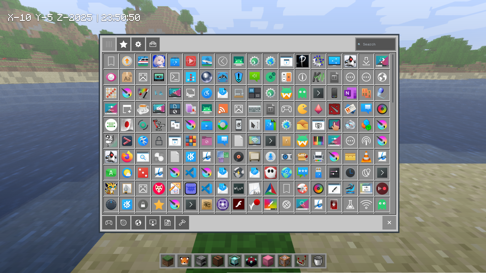
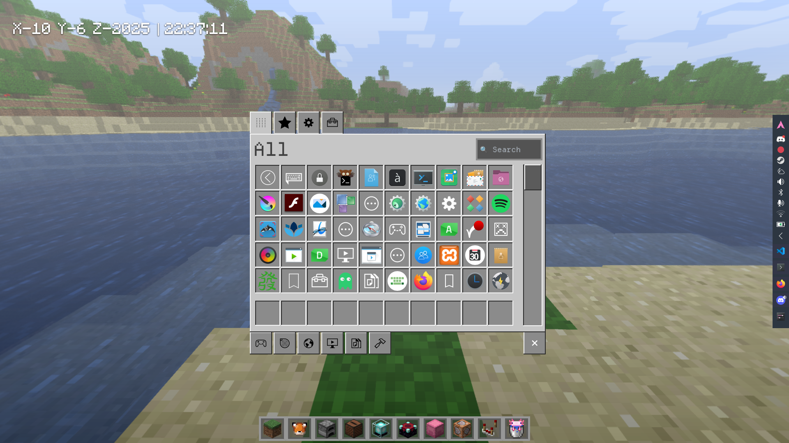
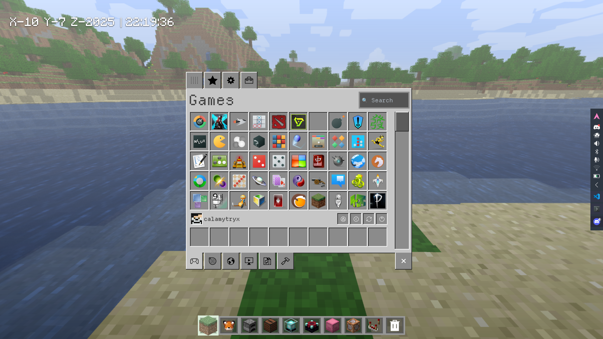

# MineLauncher

MineLauncher is a KDE Plasma 6 application launcher styled after the Minecraft
Creative Inventory. Applications are shown in a fixed nine-column grid with
Minecraft-style borders, category tabs along the top and bottom, a favorites
bar, a search field, a user bar, and session power controls.

The package identifier is `mc_inventory` and the display name is "MC Inventory".





## Requirements

- KDE Plasma 6 (the package sets `X-Plasma-API-Minimum-Version` to 6.0)
- Qt 6
- Standard Plasma command-line tools, used at runtime: `kstart`, `qdbus`,
  `loginctl`
- An internet connection if you use the default mc-heads.net avatar

## Features

- Nine-column application grid, five rows visible, scrollable for the rest.
- Category tabs. Top: All, Favorites, System, Utilities. Bottom: Games,
  Graphics, Internet, Multimedia, Office, Development.
- Favorites bar with nine slots below the grid.
- Real-time search that filters the grid by application name.
- User bar showing the current username and a Minecraft-style avatar.
- Session controls: lock, logout, reboot, shutdown.
- Custom scrollbar that snaps to grid rows.
- Configurable launcher icon, icon size, and avatar source.

## Installation

### Local install

```bash
mkdir -p ~/.local/share/plasma/plasmoids/
cp -r mc_inventory ~/.local/share/plasma/plasmoids/
```

Then right-click the desktop or a panel, choose Add Widgets, and search for
"MC Inventory".

If the widget does not appear, refresh the package cache and restart Plasma:

```bash
kbuildsycoca6 --noincremental
kquitapp6 plasmashell
kstart plasmashell
```

### Package install

Run these from the directory that contains the `mc_inventory` folder:

```bash
# Install
kpackagetool6 -t Plasma/Applet -i mc_inventory

# Update an existing installation
kpackagetool6 -t Plasma/Applet -u mc_inventory
```

The installed folder name must match the `Id` field in `metadata.json`
(`mc_inventory`). Plasma resolves the widget by that identifier, so a
mismatched folder name will fail to load.

## Usage

### Interactions

- Left-click an application to launch it.
- Right-click an application to add or remove it from favorites.
- Scroll with the mouse wheel to move through the grid; scrolling snaps to
  whole rows.
- Type in the search field to filter applications by name.

### Categories

The current category name is shown above the grid. Selecting a tab filters the
grid to applications whose desktop-entry categories match that tab. "All" shows
everything; "Favorites" shows pinned applications.

### Favorites

- Right-click an application in the grid to pin it.
- The favorites bar shows up to nine pinned applications.
- Favorites are stored in the widget configuration as a comma-separated list;
  if more than nine are saved, only the first nine appear in the bar.
- Right-click an entry in the favorites bar to unpin it.

### Application launching

Applications are launched with `kstart --application <name>`. This resolves the
desktop entry through the same KService database that the menu is built from
and honours `Exec` field codes, terminal applications, D-Bus activation, and
startup notification.

### Session controls

The buttons are in the user bar, below the grid:

| Button   | Action                                                              |
|----------|---------------------------------------------------------------------|
| Lock     | Locks the session (`loginctl lock-session`). No confirmation.       |
| Logout   | Opens the KDE logout confirmation screen (`org.kde.LogoutPrompt`).  |
| Reboot   | Opens the KDE restart confirmation screen.                          |
| Shutdown | Opens the KDE shutdown confirmation screen.                         |

Logout, reboot, and shutdown go through `org.kde.LogoutPrompt`, so they show
the standard KDE confirmation dialog rather than acting immediately.

## Configuration

Right-click the widget and choose Configure to open the General settings page.

| Setting           | Description                                              | Default         |
|-------------------|----------------------------------------------------------|-----------------|
| Launcher Icon     | Icon shown for the widget in the panel or on the desktop | `start-here-kde`|
| Icon Size         | Launcher icon size in pixels (range 16-256)              | 48              |
| Custom Avatar URL | Image URL for the user bar avatar                        | empty           |
| Always Expanded   | Keep the launcher visible instead of click-to-expand     | off             |

When Custom Avatar URL is empty, the avatar is fetched from
`https://mc-heads.net/avatar/<username>/100.png`, where `<username>` comes from
`whoami`. Providing a URL overrides this.

## Project structure

```
mc_inventory
├── contents
│   ├── config
│   │   ├── config.qml
│   │   └── main.xml
│   ├── ui
│   │   ├── CategoryTab.qml
│   │   ├── CompactRepresentation.qml
│   │   ├── DashboardRepresentation.qml
│   │   ├── InventorySlot.qml
│   │   ├── StaticFavoriteGrid.qml
│   │   ├── StaticGrid.qml
│   │   ├── configGeneral.qml
│   │   └── main.qml
│   ├── minecraft-items
│   └── textures
├── grass_block.png
├── metadata.json
├── preview.png
├── preview2.png
├── preview3.png
└── LICENSE
```

| File                          | Purpose                                                        |
|-------------------------------|----------------------------------------------------------------|
| `main.qml`                    | Root item; app data model, category and search logic, launch.  |
| `CompactRepresentation.qml`   | Panel/compact button that opens the launcher.                  |
| `DashboardRepresentation.qml` | Full launcher window: grid, tabs, search, user bar, controls.  |
| `InventorySlot.qml`           | A single app slot with icon, tooltip, and click handling.      |
| `CategoryTab.qml`             | A category tab with icon and selected state.                   |
| `StaticGrid.qml`              | Border and background for the main grid.                       |
| `StaticFavoriteGrid.qml`      | Border and background for the favorites bar.                   |
| `configGeneral.qml`           | The configuration dialog UI.                                   |
| `config/main.xml`             | Configuration keys and defaults.                               |
| `config/config.qml`           | Registers the General settings page.                           |
| `metadata.json`               | Plasma package manifest.                                       |
| `minecraft-items/`, `textures/` | Image assets.                                                |

## Development

Restart Plasma after changing QML:

```bash
kquitapp6 plasmashell
kstart plasmashell
```

Watch the log output while testing:

```bash
journalctl --user -f | grep plasmashell
```

Notes:

- Keep the `Id` in `metadata.json` equal to the installed folder name.
- Use Qt 6 and Plasma 6 APIs only.

## Uninstall

```bash
# If installed by copying
rm -rf ~/.local/share/plasma/plasmoids/mc_inventory/

# If installed with kpackagetool6
kpackagetool6 -t Plasma/Applet -r mc_inventory
```

Then restart Plasma:

```bash
kquitapp6 plasmashell
kstart plasmashell
```

## License

`metadata.json` declares the license as `GPL-2.0+` and the QML source headers
use `GPL-2.0-or-later`. The bundled `LICENSE` file contains the GNU General
Public License, version 3. See [LICENSE](LICENSE) for the full text.

Copyright (C) 2025 CAL.

## Credits

- Inspired by the Minecraft Creative Inventory interface.
- Built for KDE Plasma 6.
- Default avatars from [mc-heads.net](https://mc-heads.net).
- Icons from the KDE Breeze icon theme.
